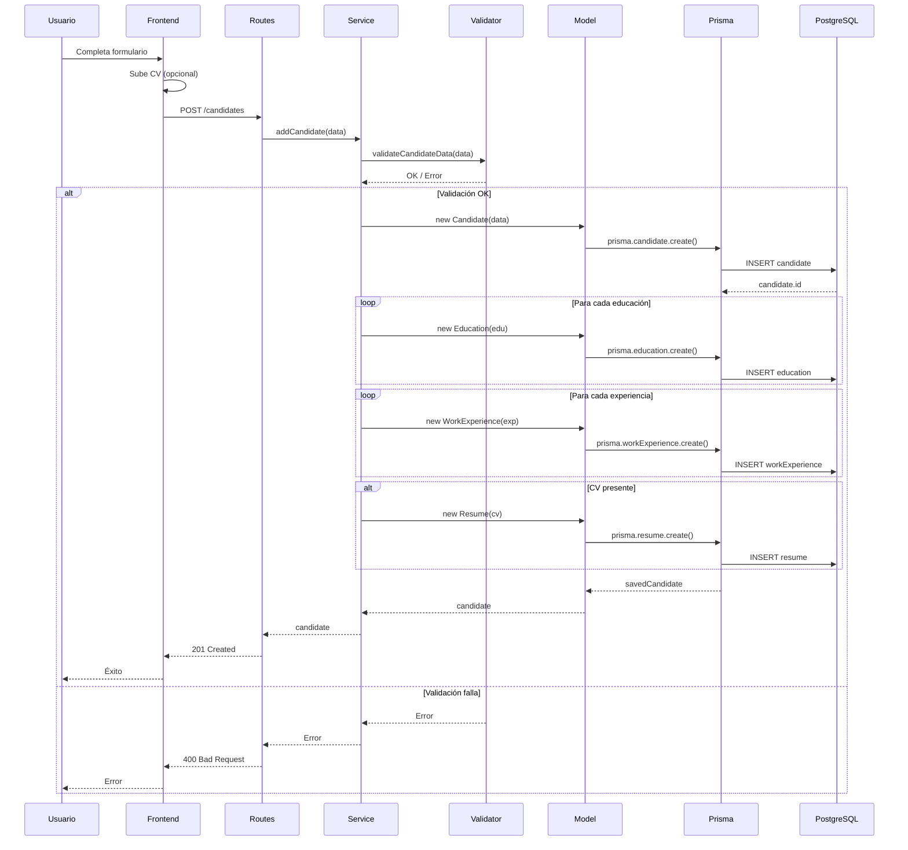
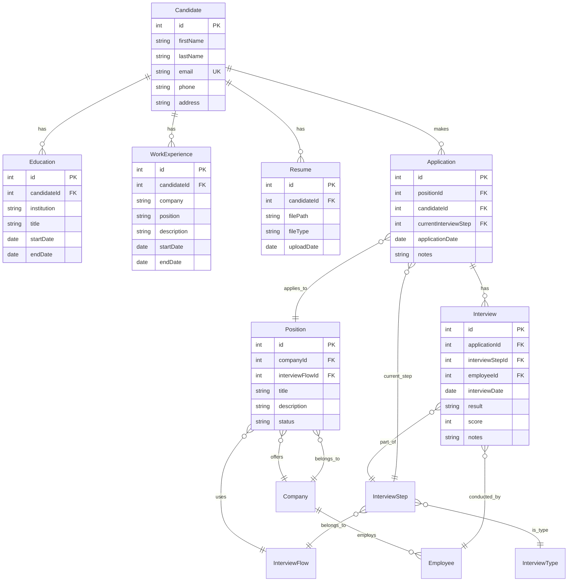
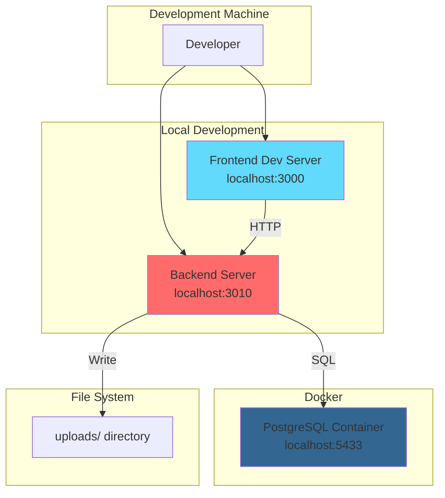

# Architecture Diagrams

## Diagrama de componentes (C4 Level 2)

```mermaid
graph TB
    subgraph "User"
        RECRUITER[Reclutador]
    end

    subgraph "Frontend Application"
        UI[React UI Components]
        ROUTER[React Router]
        API_CLIENT[API Service Layer]
    end

    subgraph "Backend API"
        EXPRESS[Express Server]
        ROUTES[Route Handlers]
        CONTROLLERS[Controllers]
        SERVICES[Application Services]
        VALIDATORS[Validators]
        MODELS[Domain Models]
    end

    subgraph "Infrastructure"
        PRISMA[Prisma ORM]
        POSTGRES[(PostgreSQL Database)]
        FILES[File System - uploads/]
        MULTER[Multer Middleware]
    end

    RECRUITER -->|HTTP| UI
    UI --> ROUTER
    ROUTER --> API_CLIENT
    API_CLIENT -->|HTTP REST| EXPRESS
    EXPRESS --> ROUTES
    ROUTES --> CONTROLLERS
    CONTROLLERS --> SERVICES
    SERVICES --> VALIDATORS
    SERVICES --> MODELS
    MODELS --> PRISMA
    PRISMA --> POSTGRES
    EXPRESS --> MULTER
    MULTER --> FILES

    style RECRUITER fill:#e1f5ff
    style POSTGRES fill:#336791
    style PRISMA fill:#2d3748
    style EXPRESS fill:#ff6b6b
```

## Diagrama de flujo de datos: Crear Candidato

## Diagrama de modelo de datos (simplificado)

## Diagrama de deployment (actual)

## Limitaciones de los diagramas

1. **Simplificados**: No muestran todos los middleware, errores, edge cases
2. **Estáticos**: No reflejan cambios en tiempo de ejecución
3. **Sin detalles de implementación**: No muestran código específico
4. **Modelo de datos incompleto**: Algunas relaciones no mostradas (InterviewStep → InterviewType, etc.)
5. **Deployment básico**: No muestra producción, CI/CD, monitoring

## Notas sobre Mermaid

-   Los diagramas se renderizan en Markdown viewers que soporten Mermaid (GitHub, GitLab, muchos editores)
-   Si no se renderizan, usar herramientas online: https://mermaid.live/
-   Para editar: Modificar código Mermaid en este archivo
