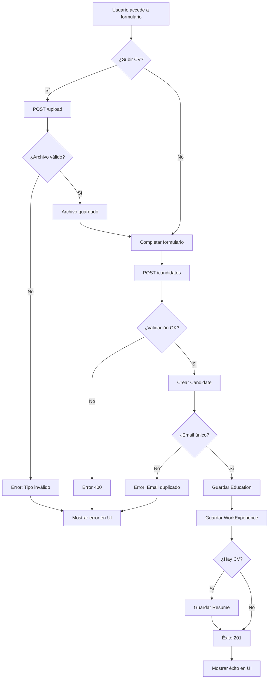

# Key Flows

## Flujo 1: Añadir Candidato (Implementado)

### Descripción

Flujo completo para añadir un nuevo candidato al sistema, incluyendo subida de CV opcional.

### Pasos

1. **Usuario accede al formulario**

    - Frontend: `/add-candidate`
    - Componente: `AddCandidateForm.js`

2. **Subir CV (opcional)**

    - Usuario selecciona archivo PDF/DOCX
    - Frontend: POST `/upload` con `multipart/form-data`
    - Backend: `fileUploadService.uploadFile()`
    - Validación: Tipo (PDF/DOCX), tamaño (10MB)
    - Almacenamiento: `../uploads/` con nombre único
    - Respuesta: `{ filePath, fileType }`

3. **Completar formulario**

    - Usuario completa:
        - Datos personales (nombre, apellido, email, teléfono, dirección)
        - Educación (múltiples entradas)
        - Experiencia laboral (múltiples entradas)
        - Referencia al CV (si se subió)

4. **Enviar formulario**

    - Frontend: POST `/candidates` con JSON
    - Backend: `candidateRoutes.ts` → `candidateService.addCandidate()`

5. **Validación**

    - `validator.validateCandidateData()`
    - Validaciones:
        - Nombres: regex + longitud
        - Email: regex + único
        - Teléfono: regex español
        - Fechas: formato YYYY-MM-DD
        - Educación y experiencia: campos requeridos

6. **Persistencia**

    - Crear Candidate en BD
    - Obtener ID del candidato creado
    - Crear Education records (si hay)
    - Crear WorkExperience records (si hay)
    - Crear Resume record (si hay CV)

7. **Respuesta**
    - Backend: 201 Created con candidato creado
    - Frontend: Mostrar éxito/error

### Archivos involucrados

-   `frontend/src/components/AddCandidateForm.js`
-   `frontend/src/components/FileUploader.js`
-   `frontend/src/services/candidateService.js`
-   `backend/src/routes/candidateRoutes.ts`
-   `backend/src/application/services/candidateService.ts`
-   `backend/src/application/validator.ts`
-   `backend/src/domain/models/Candidate.ts`
-   `backend/src/application/services/fileUploadService.ts`

### Casos de error

-   **Email duplicado**: 400 "The email already exists in the database"
-   **Validación falla**: 400 con mensaje específico
-   **Archivo inválido**: 400 "Invalid file type, only PDF and DOCX are allowed!"
-   **BD no disponible**: 500 con mensaje genérico

---

## Flujo 2: Obtener Candidato (Implementado)

### Descripción

Obtener información completa de un candidato por su ID.

### Pasos

1. **Solicitud**

    - Frontend/API: GET `/candidates/:id`
    - Backend: `candidateRoutes.ts` → `getCandidateById()`

2. **Validación de ID**

    - Parsear `req.params.id` a número
    - Si no es número: 400 "Invalid ID format"

3. **Búsqueda**

    - `candidateService.findCandidateById(id)`
    - `Candidate.findOne(id)` → Prisma query con includes:
        - `educations`
        - `workExperiences`
        - `resumes`
        - `applications` (con `position` e `interviews`)

4. **Respuesta**
    - Si encontrado: 200 con JSON completo
    - Si no encontrado: 404 "Candidate not found"
    - Si error: 500 "Internal Server Error"

### Archivos involucrados

-   `backend/src/routes/candidateRoutes.ts:20`
-   `backend/src/presentation/controllers/candidateController.ts:18-32`
-   `backend/src/application/services/candidateService.ts:57-65`
-   `backend/src/domain/models/Candidate.ts:129-162`

---

## Flujo 3: Visualizar Candidatos en Proceso (Implementado)

### Descripción

Reclutador visualiza todos los candidatos que están en proceso para una posición específica en una interfaz tipo Kanban.

### Pasos

1. **Solicitar candidatos en proceso**

    - Frontend/API: GET `/positions/:id/candidates`
    - Backend: `positionRoutes.ts` → `getCandidatesByPositionController()`

2. **Validación de ID**

    - Parsear `req.params.id` a número entero positivo
    - Si no es válido: 400 "Invalid position ID format"

3. **Obtener aplicaciones**

    - `applicationService.getCandidatesByPosition(positionId)`
    - Query Prisma con includes:
        - `candidate` (firstName, lastName)
        - `interviewStep` (id, name)
        - `interviews` (score)

4. **Calcular puntuación media**

    - Filtrar entrevistas con `score !== null`
    - Calcular promedio: `sum(scores) / count(scores)`
    - Si no hay scores: retornar `null`

5. **Formatear respuesta**

    - Concatenar `firstName + " " + lastName` → `fullName`
    - Incluir `currentInterviewStep` con id y name
    - Incluir `averageScore` (number | null)
    - Incluir `applicationId` y `candidateId`

6. **Respuesta**
    - Si éxito: 200 con array de candidatos
    - Si posición no existe: 404 "Position not found"
    - Si error: 500 "Internal Server Error"

### Archivos involucrados

-   `backend/src/routes/positionRoutes.ts`
-   `backend/src/presentation/controllers/positionController.ts`
-   `backend/src/application/services/applicationService.ts:getCandidatesByPosition()`

### Casos de error

-   **ID inválido**: 400 "Invalid position ID format"
-   **Posición no existe**: 404 "Position not found"
-   **Sin aplicaciones**: 200 con array vacío `[]`
-   **Sin entrevistas**: `averageScore = null`

---

## Flujo 4: Actualizar Etapa del Proceso (Implementado)

### Descripción

Reclutador mueve un candidato a una nueva etapa del proceso de selección en una interfaz tipo Kanban.

### Pasos

1. **Solicitar actualización**

    - Frontend/API: PUT `/candidates/:id/stage`
    - Body: `{ positionId, currentInterviewStep }`
    - Backend: `candidateRoutes.ts` → `updateCandidateStageController()`

2. **Validación de entrada**

    - Validar `candidateId` es entero positivo
    - Validar `positionId` en body es entero positivo
    - Validar `currentInterviewStep` en body es entero positivo
    - Si alguna validación falla: 400 con mensaje específico

3. **Buscar aplicación**

    - `applicationService.updateCandidateStage(candidateId, positionId, newStepId)`
    - Buscar Application por `candidateId` y `positionId`
    - Si no existe: Error "Application not found" → 404

4. **Validar posición**

    - Obtener Position por `positionId`
    - Si no existe: Error "Position not found" → 404

5. **Validar paso de entrevista**

    - Obtener InterviewStep por `newStepId`
    - Si no existe: Error "Interview step not found" → 404
    - Validar que `step.interviewFlowId === position.interviewFlowId`
    - Si no coincide: Error "Invalid interview step for this position" → 404

6. **Actualizar aplicación**

    - Actualizar `currentInterviewStep` en Application
    - Incluir relaciones: candidate, interviewStep, position

7. **Respuesta**
    - Si éxito: 200 con Application actualizada
    - Si error de validación: 400/404 según tipo de error
    - Si error inesperado: 500 "Internal Server Error"

### Archivos involucrados

-   `backend/src/routes/candidateRoutes.ts`
-   `backend/src/presentation/controllers/candidateController.ts:updateCandidateStageController()`
-   `backend/src/application/services/applicationService.ts:updateCandidateStage()`

### Casos de error

-   **ID inválido**: 400 "Invalid candidate ID format"
-   **Body inválido**: 400 "Invalid request body..."
-   **Aplicación no existe**: 404 "Application not found"
-   **Posición no existe**: 404 "Position not found"
-   **Paso inválido**: 404 "Invalid interview step for this position"
-   **Error Prisma P2025**: 404 (manejado automáticamente)

---

## Flujo 5: Aplicar a Posición (No implementado)

### Descripción

Un candidato aplica a una posición de trabajo.

### Pasos propuestos

1. **Candidato selecciona posición**

    - Frontend: Lista de posiciones disponibles
    - Usuario hace clic en "Aplicar"

2. **Crear Application**

    - Frontend: POST `/applications`
    - Body: `{ positionId, candidateId }`
    - Backend: Validar que posición existe y está visible
    - Backend: Validar que candidato no ha aplicado antes (opcional)

3. **Inicializar flujo de entrevista**

    - Obtener `interviewFlow` de la posición
    - Obtener primer `interviewStep` (orderIndex = 1)
    - Crear Application con `currentInterviewStep = primer paso`

4. **Notificaciones** (futuro)
    - Email a candidato confirmando aplicación
    - Notificación a reclutadores

### Estado

**No implementado**. Modelos existen pero sin endpoints para crear aplicaciones.

---

## Flujo 6: Realizar Entrevista (No implementado)

### Descripción

Un empleado realiza una entrevista a un candidato en una aplicación.

### Pasos propuestos

1. **Programar entrevista**

    - Reclutador: Selecciona aplicación
    - Selecciona paso de entrevista
    - Selecciona entrevistador (Employee)
    - Fija fecha/hora

2. **Crear Interview**

    - POST `/interviews`
    - Body: `{ applicationId, interviewStepId, employeeId, interviewDate }`

3. **Realizar entrevista**

    - Entrevistador completa formulario:
        - Resultado (aprobado/rechazado/pendiente)
        - Score (opcional)
        - Notas

4. **Actualizar Application**
    - Si entrevista aprobada: Avanzar a siguiente paso
    - Si rechazada: Marcar aplicación como rechazada
    - Actualizar `currentInterviewStep`

### Estado

**No implementado**. Modelos existen pero sin endpoints.

---

## Flujo 7: Gestionar Posiciones (No implementado)

### Descripción

Reclutador crea y gestiona posiciones de trabajo.

### Pasos propuestos

1. **Crear posición**

    - POST `/positions`
    - Body: Datos de la posición (title, description, requirements, etc.)
    - Asignar `interviewFlow`
    - Estado inicial: "Draft"

2. **Publicar posición**

    - PUT `/positions/:id`
    - Cambiar `status` a "Published"
    - Cambiar `isVisible` a true

3. **Listar posiciones**
    - GET `/positions?status=Published&isVisible=true`
    - Filtros: status, company, location

### Estado

**No implementado**. Modelos existen pero sin endpoints.

---

## Diagrama de flujo: Añadir Candidato

---

## Notas sobre flujos

### Implementados

-   ✅ Añadir candidato (completo)
-   ✅ Obtener candidato (completo)
-   ✅ Subir archivo (completo)
-   ✅ Visualizar candidatos en proceso (completo) - GET `/positions/:id/candidates`
-   ✅ Actualizar etapa del proceso (completo) - PUT `/candidates/:id/stage`

### Parcialmente implementados

-   ⚠️ Dashboard: UI existe pero funcionalidad limitada

### No implementados

-   ❌ Aplicar a posición
-   ❌ Gestionar entrevistas
-   ❌ Gestionar posiciones
-   ❌ Gestionar empresas
-   ❌ Autenticación/autorización
-   ❌ Notificaciones

### Mejoras futuras

1. **Validación de fechas**: `endDate >= startDate`
2. **Transacciones**: Operaciones atómicas (candidate + relaciones)
3. **Eventos**: Publicar eventos al crear candidato (para notificaciones)
4. **Caché**: Cachear queries frecuentes
5. **Paginación**: Para listados
