# System Patterns

## Arquitectura

**Tipo**: Monorepo con separación frontend/backend

**Backend**: Clean Architecture / Layered Architecture

-   **Domain Layer** (`backend/src/domain/models/`): Modelos de negocio con lógica de persistencia
-   **Application Layer** (`backend/src/application/`): Servicios de aplicación y validadores
-   **Presentation Layer** (`backend/src/presentation/controllers/`): Controladores HTTP
-   **Routes** (`backend/src/routes/`): Definición de rutas Express
-   **Infrastructure**: Prisma Client (ORM) como única dependencia de infraestructura

**Frontend**: React SPA (Single Page Application)

-   Componentes funcionales
-   Servicios para llamadas API (`frontend/src/services/`)

**Base de datos**: PostgreSQL con Prisma ORM

## Patrones repetidos en el código

### 1. Active Record Pattern (Domain Models)

Los modelos de dominio (`Candidate`, `Education`, etc.) extienden la responsabilidad de persistencia:

```typescript
// Ejemplo: Candidate.ts
class Candidate {
    async save() {
        /* usa Prisma directamente */
    }
    static async findOne(id: number) {
        /* usa Prisma directamente */
    }
}
```

**Dónde**: `backend/src/domain/models/*.ts`

**Riesgo**: Acoplamiento directo con Prisma en modelos de dominio (viola Clean Architecture estricta)

**⚠️ Violaciones identificadas** (ver `documentation/best_practices.md`):

-   Viola **Dependency Inversion Principle (DIP)**: Dominio depende de infraestructura
-   Viola **Single Responsibility Principle (SRP)**: Modelos tienen dos responsabilidades (lógica de negocio + persistencia)
-   Imposible testear sin base de datos
-   Dificulta cambiar de ORM

**Recomendación**: Migrar a Repository Pattern (ver `documentation/best_practices.md` sección DDD)

### 2. Service Layer Pattern

Servicios de aplicación coordinan lógica de negocio:

```typescript
// candidateService.ts
export const addCandidate = async (candidateData: any) => {
    validateCandidateData(candidateData);
    const candidate = new Candidate(candidateData);
    const savedCandidate = await candidate.save();
    // ... guardar relaciones
};
```

**Dónde**: `backend/src/application/services/*.ts`

**⚠️ Mejoras necesarias** (ver `documentation/best_practices.md`):

-   Debería usar inyección de dependencias
-   Debería depender de abstracciones (repositorios) en lugar de modelos con persistencia
-   Lógica de negocio compleja debería estar en Domain Services, no en Application Services

### 3. Controller Pattern

Controladores manejan HTTP request/response:

```typescript
export const getCandidateById = async (req: Request, res: Response) => {
    const id = parseInt(req.params.id);
    const candidate = await findCandidateById(id);
    res.json(candidate);
};
```

**Dónde**: `backend/src/presentation/controllers/*.ts`

**⚠️ Inconsistencia detectada**:

-   `candidateRoutes.ts` no usa el controlador `addCandidateController`
-   Llamada directa a servicio desde ruta (ver `candidateRoutes.ts:9`)
-   **Recomendación**: Usar controladores consistentemente (ver `documentation/best_practices.md`)

### 4. Route Handler Pattern

Rutas definen endpoints y manejan errores HTTP:

```typescript
router.post("/", async (req, res) => {
    try {
        const result = await addCandidate(req.body);
        res.status(201).send(result);
    } catch (error) {
        res.status(400).send({ message: error.message });
    }
});
```

**Dónde**: `backend/src/routes/*.ts`

### 5. Middleware Pattern

-   **Prisma injection**: Middleware que añade `prisma` a `req.prisma`
-   **CORS**: Configurado para desarrollo
-   **JSON parsing**: `express.json()`
-   **Error handling**: Middleware global de errores

**Dónde**: `backend/src/index.ts`

### 6. Validator Pattern

Validación centralizada con funciones específicas por campo:

```typescript
const validateName = (name: string) => {
    /* regex + length */
};
const validateEmail = (email: string) => {
    /* regex */
};
export const validateCandidateData = (data: any) => {
    /* valida todo */
};
```

**Dónde**: `backend/src/application/validator.ts`

**⚠️ Violaciones identificadas** (ver `documentation/best_practices.md`):

-   Viola **Single Responsibility Principle (SRP)**: Valida campos individuales, colecciones y lógica condicional
-   Viola **Open/Closed Principle (OCP)**: Validación hardcodeada, difícil de extender
-   Validación mezclada (formato + lógica de negocio)
-   Falta de Value Objects: validación debería estar en el dominio

**Recomendación**:

-   Separar validadores por responsabilidad (FieldValidator, EducationValidator, etc.)
-   Crear Value Objects para validación en dominio (Email, Phone, DateRange)
-   Usar Strategy Pattern para validación configurable

## Convenciones de carpetas y naming

### Backend

```
backend/
├── src/
│   ├── domain/models/        # Modelos de dominio (PascalCase: Candidate.ts)
│   ├── application/
│   │   ├── services/         # Servicios (camelCase: candidateService.ts)
│   │   └── validator.ts      # Validadores
│   ├── presentation/
│   │   └── controllers/      # Controladores (camelCase: candidateController.ts)
│   ├── routes/               # Rutas (camelCase: candidateRoutes.ts)
│   └── index.ts              # Entry point
├── prisma/
│   ├── schema.prisma         # Schema de BD
│   └── migrations/           # Migraciones
└── package.json
```

### Frontend

```
frontend/
├── src/
│   ├── components/           # Componentes React (PascalCase: AddCandidateForm.js)
│   ├── services/             # Servicios API (camelCase: candidateService.js)
│   ├── assets/               # Imágenes, etc.
│   └── App.tsx               # Componente raíz
└── public/                   # Archivos estáticos
```

### Naming conventions

-   **Archivos TypeScript**: camelCase para servicios/rutas, PascalCase para modelos/componentes
-   **Archivos JavaScript**: Similar a TypeScript
-   **Clases**: PascalCase
-   **Funciones/variables**: camelCase
-   **Constantes**: UPPER_SNAKE_CASE (no detectado, pero común)

## Relaciones entre componentes

### Flujo de creación de candidato

```
HTTP Request (POST /candidates)
    ↓
candidateRoutes.ts (router.post)
    ↓
candidateController.ts (addCandidateController) [NO USADO]
    ↓
candidateService.ts (addCandidate)
    ↓
validator.ts (validateCandidateData)
    ↓
Candidate.ts (new Candidate + save())
    ↓
Prisma Client → PostgreSQL
```

**Nota**: Hay inconsistencia: `candidateRoutes.ts` llama directamente a `addCandidate` del servicio, no al controlador `addCandidateController`.

### Flujo de subida de archivo

```
HTTP Request (POST /upload, multipart/form-data)
    ↓
index.ts (app.post('/upload', uploadFile))
    ↓
fileUploadService.ts (uploadFile)
    ↓
Multer (middleware)
    ↓
Disk Storage (../uploads/)
    ↓
Response { filePath, fileType }
```

### Dependencias entre módulos

```
index.ts
├── candidateRoutes → candidateController → candidateService → Candidate
├── fileUploadService (standalone)
└── PrismaClient (singleton)
```

**Dónde cambiar**:

-   **Nuevos endpoints**: Añadir ruta en `backend/src/routes/`, controlador en `backend/src/presentation/controllers/`, servicio en `backend/src/application/services/`
-   **Nueva validación**: Añadir función en `backend/src/application/validator.ts`
-   **Nuevo modelo**: Crear en `backend/src/domain/models/`, añadir al schema Prisma

## Diagrama de arquitectura

```mermaid
graph TB
    subgraph "Frontend (React)"
        UI[Componentes React]
        API_SERVICE[Servicios API]
    end

    subgraph "Backend (Express)"
        ROUTES[Rutas]
        CONTROLLERS[Controladores]
        SERVICES[Servicios]
        VALIDATOR[Validador]
        MODELS[Modelos Domain]
    end

    subgraph "Infrastructure"
        PRISMA[Prisma Client]
        POSTGRES[(PostgreSQL)]
        MULTER[Multer/File System]
    end

    UI --> API_SERVICE
    API_SERVICE -->|HTTP| ROUTES
    ROUTES --> CONTROLLERS
    CONTROLLERS --> SERVICES
    SERVICES --> VALIDATOR
    SERVICES --> MODELS
    MODELS --> PRISMA
    PRISMA --> POSTGRES
    SERVICES --> MULTER

    style UI fill:#e1f5ff
    style POSTGRES fill:#336791
    style PRISMA fill:#2d3748
```



**Limitaciones del diagrama**:

-   No muestra el flujo completo de subida de archivos
-   No muestra relaciones entre modelos de dominio
-   Simplifica la capa de presentación (no muestra middleware)

## Documentación de buenas prácticas

**📋 Ver `documentation/best_practices.md`** para análisis detallado de:

-   Violaciones de principios SOLID (SRP, OCP, LSP, ISP, DIP)
-   Violaciones de DDD (Active Record vs Repository, falta de Value Objects)
-   Estado de TDD (sin tests implementados)
-   Duplicaciones (DRY)
-   Patrones recomendados (Repository, Factory, Strategy, Unit of Work)
-   Recomendaciones priorizadas con estimaciones de esfuerzo
